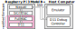

# D11emu: A BCM43 D11 Emulation Framework
D11emu is an open-source emulation framework for Broadcom’s IEEE 802.11 MAC implementation, namely D11.
In combination with our corresponding [firmware patch](https://github.com/seemoo-lab/wintech23_nexmon_d11debug) for the WiFi chip, this framework enables essential debugging methods, including microcode breakpoints and D11 state extraction. This toolset allows researchers to analyze the D11 microcode in a controlled environment dynamically.

We encourage everyone interested to enter the game, roll the D11, and provide new insights on Broadcom’s MAC implementation.

For more insights into the D11 architecture and an overview of the emulator's internals, read our paper [**Rolling the D11: An Emulation Game for the Whole BCM43 Family**](https://doi.org/10.1145/3615453.3616520).

## Setup


The D11 Emulator is designed to be connected to a Raspberry Pi 3 Model B+ or Raspberry Pi 4 Model B. The `bcm43455c0` WiFi SoC of the attached device must run a [modified firmware](https://github.com/seemoo-lab/wintech23_nexmon_d11debug). Nevertheless, the D11 Emulator can be used as a standalone application. In this case, state extraction features cannot be used. The D11 Debug Controller is part of the [utilities](#utilities).

## Installation and Startup
1. [Install Rust and Cargo](https://www.rust-lang.org/learn/get-started)
2. Clone this repository and enter the created directory.
3. Update configuration. (see [Config](#config) Section below)
4. Make sure the `b43-asm` assembler version 3 is installed and accessible in your `PATH`. It is part of the [Nexmon](https://nexmon.org) repository and can be installed by running the following commands:
    ```
    cd nexmon
    source setup_env.sh
    cd buildtools/b43-v3/assembler/
    make
    sudo make install
    ```
    The assembler is needed to assemble the microcode files located in `tests/*.asm`. They are needed to conduct the unit tests of the project, and therefore, are assembled during the build process of the emulator. If you just build the project and don't want to conduct the unit tests (`cargo test`), you can remove the following line from the `Cargo.toml` file:
    ```
    build = "build.rs"
    ```
5. Execute `cargo run -- {PATH_TO_UCODE_BINARY}` to start the emulator. To build and execute an optimized binary use `cargo run --release -- {PATH_TO_UCODE_BINARY}`. For further build options, please consult the [Rust](https://doc.rust-lang.org/book/) and [Cargo](https://doc.rust-lang.org/cargo/index.html) documentation. To build the project without running, you can use `cargo build` or `cargo build --release`.

To enable state extraction of a real device, please refer to our [D11debug repository](https://github.com/seemoo-lab/wintech23_nexmon_d11debug).

### Config

Configuration is written into `src/config.rs`. 
Two constants of the file must be updated before the first use of the emulator:

- `TARGET_IP_ADDRESS`: Username and IP address of the instrumented device, e.g., `pi@10.0.0.1`.
- `TARGET_SSH_KEY_LOCATION`: Location of the SSH Key to connect to the instrumented device, e.g., `/home/david/.ssh/pi_key`.

After changing the configuration, rebuild the project by running `cargo build` or `cargo run -- {PATH_TO_UCODE_BINARY}`.

### Obtaining a microcode binary

D11 microcode binaries are included in the firmware files shipped with Nexmon. Please refer to [Nexmon](https://nexmon.org)  or our [D11 debug patch repository](https://github.com/seemoo-lab/wintech23_nexmon_d11debug) on how to build and extract microcode binaries.

### Rustcoc
You can generate and open an html documentation of the project by running `cargo doc --open`.

## Usage
The D11 Emulator is designed to interpret a D11 microcode binary, assembled for D11 rev. 15 up to rev. 54. It was tested on rev. 46 and 54.

The D11 Emulator needs a path to a microcode binary as program argument. 
After startup it offers an interactive CLI to the user. Available commands are explained briefly in the following section.

### Available Commands
| Command    | Argument(s)| Comment    | Example    |
| - | ---------- | ---------- | ---------- |
| `break` | microcode address in hexadecimal | Creates a new breakpoint at the specified microcode address. | `break 0x4` |
| `continue` |- | Continues the emulation until the next breakpoint is reached.|- |
| `start` | microcode address in hexadecimal |Sets the start address of the emulation. |`start 0xB4` |
| `quit` |- |Exits the emulator application.|- |
| `next` |- |Single Stepping: Emulates exactly one instruction. |- |
| `run` |- |Starts the emulation from the specified start address. |- |
| `limit` | decimal number |Limits the execution to a specific amount of instructions. | `limit 1000000` |
| `init` | `bs`, `emu`, or no argument |Loads the init values of the D11.  | `init` |
| `end` | microcode address in hexadecimal |Sets the end address of the emulation. If this address is reached, emulation is paused.| `end 0x456`|
| `dump` | filename | Saves the complete emulation state to the specified location. | `dump example` |
| `extract` |- | Extracts a complete D11 state from an attached device. Ensure, with the help of our [patch](https://github.com/seemoo-lab/wintech23_nexmon_d11debug), that the D11 of the device is halted prior to state extraction.|- |
| `load` | filename | Loads a complete emulation state (including microcode) from the specified location. | `load example` |
| `ucode` | filename | Extracts the microcode memory from an attached device and saves it to the specified location. | `ucode raspi3` |
| `coverage` |filename | Saves the coverage information of the emulator to the specified location. This command expects the `genhtml` tool accessible in your `PATH`. It is part of the [lcov](https://github.com/linux-test-project/lcov) project. | `coverage cov_example` |
| `run_experiment` |- |Executes the showcase of our [paper](https://doi.org/10.1145/3615453.3616520). The necessary microcode to run this experiment can be obtained with the help of our [D11 Debug Patch](https://github.com/seemoo-lab/wintech23_nexmon_d11debug). |- |

### Utilities
This project contains several Python helper utilities. They are located in the folder `utilities` and described [here](utilities/README.md).


# Cite our Paper
If any use of this work results in an academic publications, please include citations to the paper cited under (1), this software (2), and the Nexmon project (2).

1. Jakob Link, David Breuer, Francesco Gringoli, and Matthias Hollick. 2023. [**Rolling the D11: An Emulation Game for the Whole BCM43 Family**](https://doi.org/10.1145/3615453.3616520). In The 17th ACM Workshop on Wireless Network Testbeds, Experimental evaluation & Characterization 2023 (ACM WiNTECH’ 23), October 6, 2023, Madrid, Spain. ACM, New York, NY, USA, 8 pages. https://doi.org/10.1145/3615453.3616520
2. Jakob Link, David Breuer, Francesco Gringoli, and Matthias Hollick. 2023. **D11emu: A BCM43 D11 Emulation Framework**. https://github.com/seemoo-lab/d11-emu
3. Matthias Schulz, Daniel Wegemer and Matthias Hollick. **Nexmon: The C-based Firmware Patching Framework**. https://nexmon.org

# Contact
* David Breuer <dbreuer@seemoo.tu-darmstadt.de>
* Jakob Link <jlink@seemoo.tu-darmstadt.de>

## Powered By
### Secure Mobile Networking Lab (SEEMOO)
<a href="https://www.seemoo.tu-darmstadt.de"></a>
### Multi-Mechanisms Adaptation for the Future Internet (MAKI)
<a href="http://www.maki.tu-darmstadt.de/"></a>
### Technische Universität Darmstadt
<a href="https://www.tu-darmstadt.de/index.en.jsp"></a>
### University of Brescia
<a href="http://netweb.ing.unibs.it/"></a>
